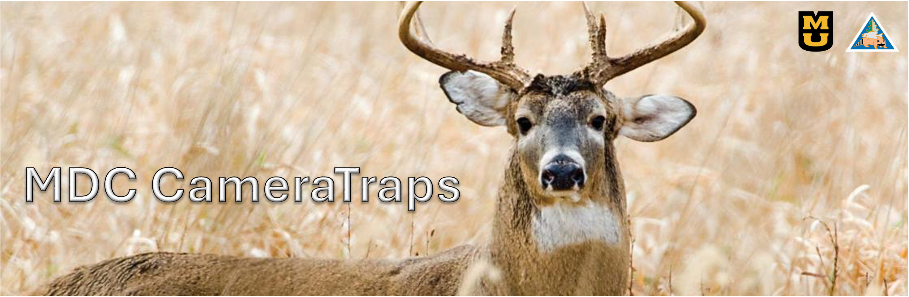

---

## Introduction
MDC CameraTrap Analysis is a comprehensive animal analysis tool developed for MDC (Missouri Department of Conservation). This project focuses on processing CameraTrap image data and provides the following key functionalities:
- **Existence**: Detects whether animals are present in the images.
- **Counting**: Counts the number of animals in a single image or a sequence of images.
- **Detection**: Detects and localizes animals within images.
- **Classification**: Classifies different animal species captured by CameraTraps.

The project supports both single-image analysis and batch processing for continuous shooting mode (sequential images), offering a complete solution for wildlife monitoring.

---

## Announcements
- **[2025-01-07]**: Initial release with core functionalities including existence detection, counting, object detection, and classification.
- Future updates will include more refined models, enhanced performance, and detailed documentation.

---

## Installation
1. **Clone the repository**:
   ```bash
   git clone https://github.com/your-username/MDC_CameraTrap_Analysis.git
   cd MDC_CameraTrap_Analysis
2. **Clone the repository**:
   ```bash
   pip install -r requirements.txt
3. **Download pre-trained models: (Note: Currently, initial versions of the models are provided directly in the repository. Future versions may be provided via external links.)**

---
## Dataset
To use this project, you only need to place your CameraTrap images in a folder. The system will automatically generate sequence information based on the capture metadata (e.g., timestamps).
**Dataset Structure**
   ```bash
   /path/to/your/images/
   ├── img1.jpg
   ├── img2.jpg
   ├── img3.jpg
   └── ...
   ```
Ensure all images are placed directly in the specified folder. The system will handle sequence creation and grouping automatically by extracting capture time information from the image metadata.

---

## Usage
1. **Run image level analysis**:
   ```bash
   python generate_check_csv.py
2. **Run sequence level analysis**:
   ```bash
   python generate_check_csv.py

---

## License

This project is licensed under the **MIT License**. You are free to use, modify, and distribute this project. However, please retain the original copyright notice.

See the [LICENSE](LICENSE) file for more details.、

---

## Acknowledgements

This project integrates [MegaDetector](https://github.com/microsoft/CameraTraps/blob/main/megadetector.md), an open-source animal detection model developed by Microsoft AI for Earth. We acknowledge and thank the authors of MegaDetector for their valuable contribution to the wildlife monitoring community.


****
